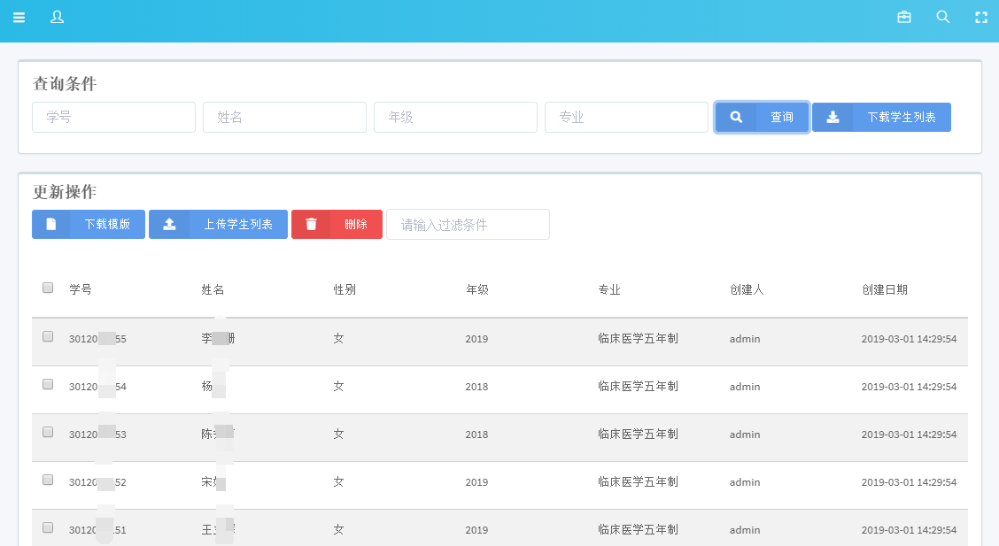
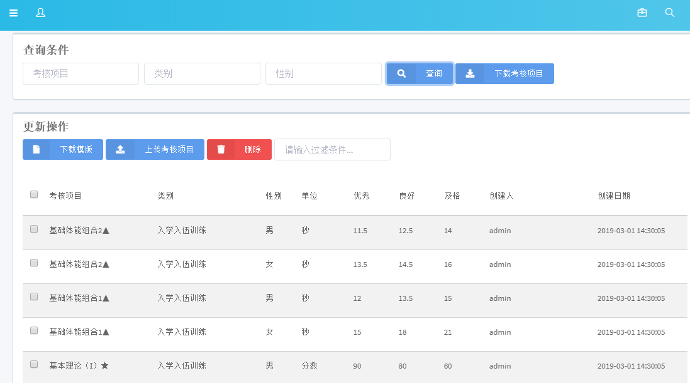
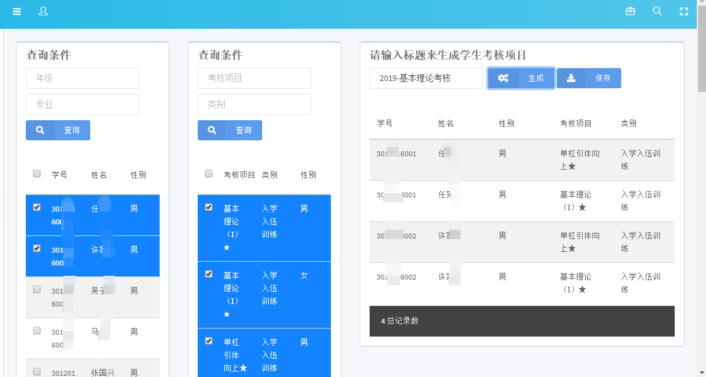
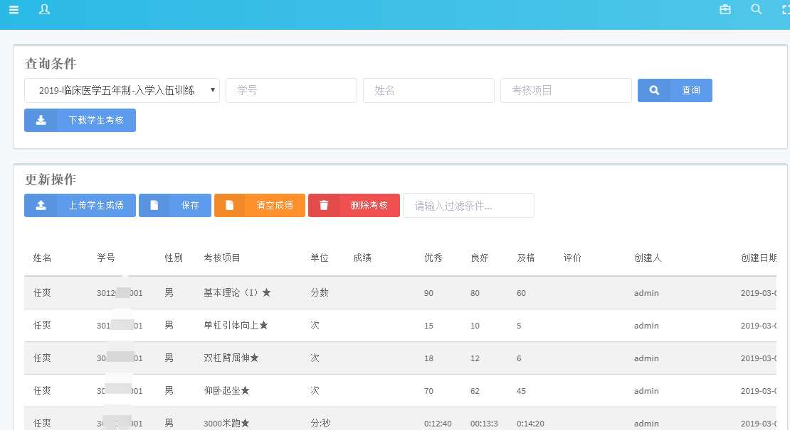
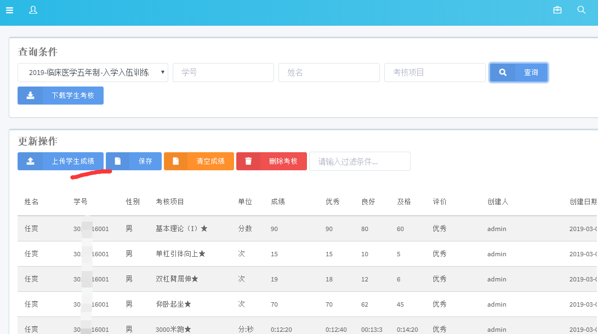
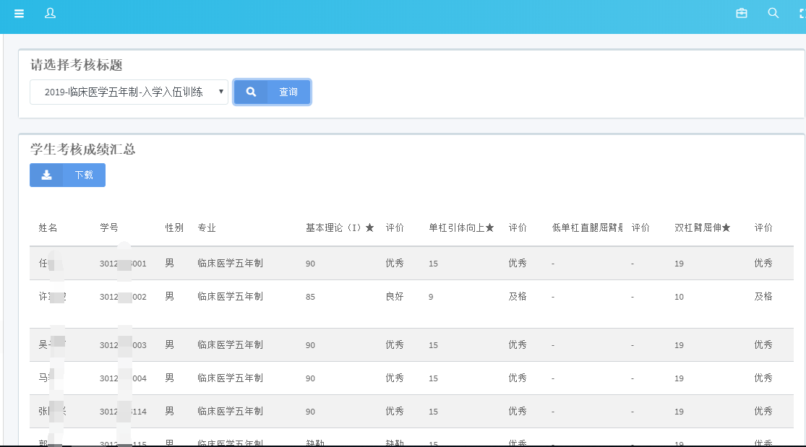
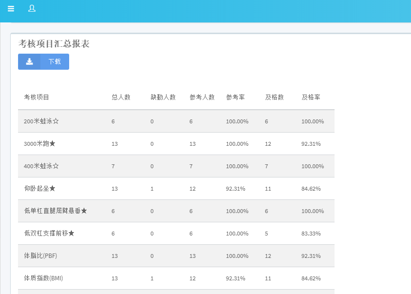

# dfitness

		项目背景
		需求说明
		系统设计
		使用手册

## 项目背景
   
    用于测试学生体能考核，评分，汇总的系统
  
## 需求说明

工作范围及详细说明

```
1. 能够通过excel软件灵活自由的实现数据表的导入，包含学生信息和考核项目标准信息。
    学生信息表的标题主要包括学号、姓名、性别、专业等字段
    考核项目信息表包含课目，分类，考核项目，性别，单位，优秀，良好，及格
2. 系统可根据不同类别的考核（入学入伍、课程必考课目等）选择不同的考核项目进行个性化选择需要的考核课目，
    并生成考核项目列表，并能够导出相应考核表
3. 系统通过录入考试成绩功能输入学员的考核数据，可以在学员考试成绩界面直接将学员的考核成绩录入系统
4. 也可以将每次考核项目数据导入系统中，系统通过比对考核标准，自动生成考核结果等
5. 系统根据学员考核a课目及成绩生成学员体能考核的总成绩，并可根据不同类别（比如按专业、按年级、按年份等）
    生成相应的统计数据，并指出导入excel，以方便纵向、横向的数据对比
```

## 系统设计

系统功能

1.学生管理
2.项目考核标准
3.学生考核单
4.学生成绩导入
5.学生成绩汇总表


## 使用手册

0.登录


主页


1.学生管理



2.项目考核标准



3.学生考核单


4.学生成绩导入



导入成绩



5.学生成绩汇总表

按学生汇总成绩


按考核标题汇总



./templcate  目录下存放excel上传模板和实例数据


